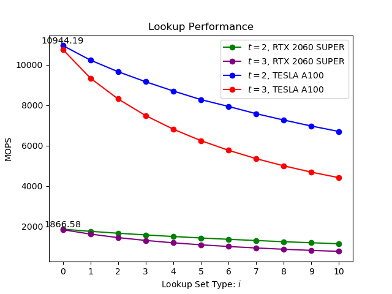
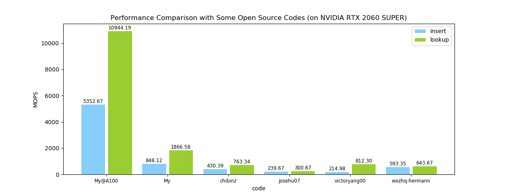

# Cuckoo Hashing using CUDA

High performance parallel hash table based on Cuckoo Hashing using CUDA.

## Build

```shell
mkdir build
cd build
cmake ..
cmake --build . --config Release -j
```

## Run

```shell
./main
```
or
```shell
.\main.exe
```

## Experiments

See details in [report](report.pdf).

## Performance




